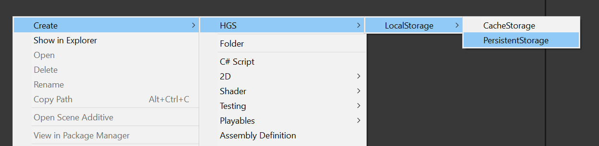
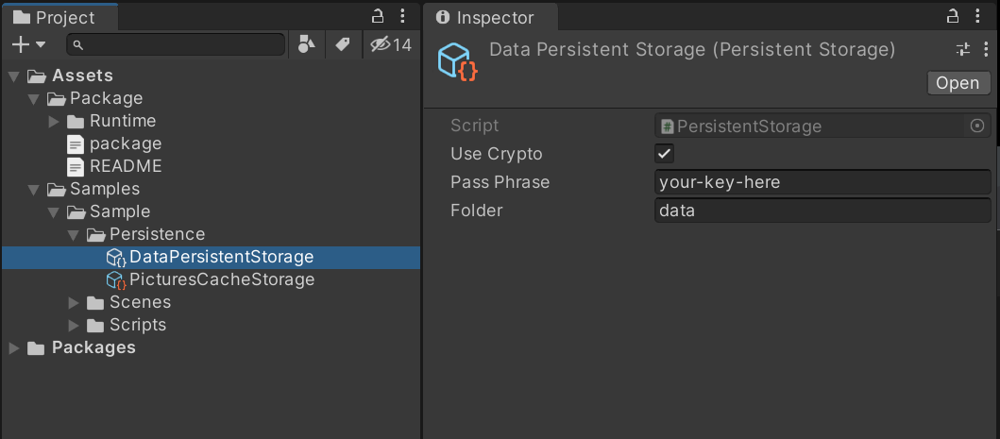
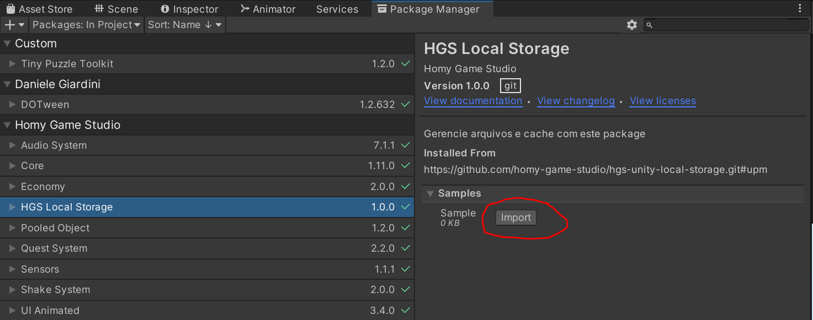

[](https://github.com/semantic-release/semantic-release)
[](https://openupm.com/packages/com.hgs.local-storage/)

# Introdução

Local Storage utiliza `ScriptableObjects` para tornar o acesso à arquivos mais facil e pratico. Este package conta com:

- Armazenamento de arquivos no disco.
- Criptografia.
- Cache de arquivos (exclusão automatica após x segundos, minutos, horas, dias).

## Instalação

OpenUPM:

`openupm add com.hgs.local-storage`

Package Manager:

`https://github.com/homy-game-studio/hgs-unity-local-storage.git#upm`

Se preferir, substitua `upm` uma versão especifica, exemplo:

`https://github.com/homy-game-studio/hgs-unity-local-storage.git#1.0.0`

## PersistentStorage

`PersistentStorage` mantém as funcionalidades basicas de gestão de arquivo e criptografia. Funciona como `PlayerPrefs`, porém sem restrição de tamanho.

Atributos

| Propriedade  | Descrição                                                                                    |
| ------------ | -------------------------------------------------------------------------------------------- |
| `useCrypto`  | Quando verdadeiro, utiliza criptografia na escrita/leitura dos arquivos no disco.            |
| `passPhrase` | Sua senha de criptografgia, utilizado apenas quando `useCrypto` for verdadeiro.              |
| `folder`     | Pasta onde os arquivos serão salvos, uma barra `/` será adicionada automaticamente no final. |

Metódos

| Metódo                                 | Retorno  | Descrição                                                                       |
| -------------------------------------- | -------- | ------------------------------------------------------------------------------- |
| `Exists(string key)`                   | `bool`   | Verifica se uma chave existe no storage.                                        |
| `WriteBytes(string key, byte[] bytes)` | `void`   | Cria/Sobrescreve um arquivo com a `key` designada, com o conteúdo de `bytes`    |
| `ReadBytes(string key)`                | `byte[]` | Lê os bytes salvos na `key` designada, retorna `null` caso o arquivo não exista |
| `Clear()`                              | `void`   | Delete all files from storage                                                   |

## CacheStorage

`CacheStorage` herda as propriedades de um PersistentStorage, porém adiciona uma camada extra para excluir arquivos expirados. É recomendado para guardar imagens de perfil, configurações remotas, e quaisquer dados que possua tempo de vida.

| Propriedade  | Descrição                                                                                    |
| ------------ | -------------------------------------------------------------------------------------------- |
| `useCrypto`  | Quando verdadeiro, utiliza criptografia na escrita/leitura dos arquivos no disco.            |
| `passPhrase` | Sua senha de criptografgia, utilizado apenas quando `useCrypto` for verdadeiro.              |
| `folder`     | Pasta onde os arquivos serão salvos, uma barra `/` será adicionada automaticamente no final. |
| `expiration` | Tempo em minutos para exclusão de automatica de um arquivo individual.                       |

| Metódo                                 | Retorno  | Descrição                                                                                          |
| -------------------------------------- | -------- | -------------------------------------------------------------------------------------------------- |
| `Exists(string key)`                   | `bool`   | Verifica se uma chave existe no storage                                                            |
| `WriteBytes(string key, byte[] bytes)` | `void`   | Cria/Sobrescreve um arquivo com a `key` designada, com o conteúdo de `bytes`                       |
| `ReadBytes(string key)`                | `byte[]` | Lê os bytes salvos na `key` designada, retorna `null` caso o arquivo não exista ou esteja expirado |
| `Clear()`                              | `void`   | Delete all files from storage                                                                      |

## Extensões

Não manipule bytes diretamente, utilize as extensões disponibilizadas no package:

### StringExtension

Disponivel em:

```cs
using HGS.LocalStorage.StringExtension;
```

| Metódo                                    | Retorno  | Descrição                                                                                           |
| ----------------------------------------- | -------- | --------------------------------------------------------------------------------------------------- |
| `WriteString(string key, string content)` | `void`   | Cria/Sobrescreve um arquivo com a `key` designada, com o conteúdo de `string`                       |
| `ReadString(string key)`                  | `string` | Lê uma string salva na `key` designada, retorna `null` caso o arquivo não exista ou esteja expirado |

### Texture2DExtension

Disponivel em:

```cs
using using HGS.LocalStorage.Texture2DExtension;
```

| Metódo                                          | Retorno     | Descrição                                                                                            |
| ----------------------------------------------- | ----------- | ---------------------------------------------------------------------------------------------------- |
| `WriteTexture2D(string key, Texture2D texture)` | `void`      | Cria/Sobrescreve um arquivo com a `key` designada, com o conteúdo de `texture`                       |
| `ReadTexture2D(string key)`                     | `Texture2D` | Lê um `Texture2D` salvo na`key`designada, retorna`null` caso o arquivo não exista ou esteja expirado |

## Criando um storage

1. Na aba project clique com o botão direito do mouse e crie um novo `PersistentStorage` ou `CacheStorage`.



2. Seu `Storage` será um `ScriptableObject`.



> É recomendado criar um `Storage` para cada pasta. Assim você evita colisão de chaves em partes destintas do seu projeto.

# Exemplos

## Exemplo completo

Você pode baixar o código de exemplo dentro do seu projeto unity através do `Package Manager`:



## Escrita e leitura de string

```cs
using HGS.LocalStorage;
using HGS.LocalStorage.StringExtension;
using UnityEngine;
using UnityEngine.UI;

public class StringSample : MonoBehaviour
{
  [SerializeField] Storage storage;
  [SerializeField] string key;
  [SerializeField] InputField inputField;
  [SerializeField] Button writeBtn;
  [SerializeField] Button readBtn;

  void Awake()
  {
    writeBtn.onClick.AddListener(HandleOnClickBtnWrite);
    readBtn.onClick.AddListener(HandleOnClickBtnRead);
  }

  private void HandleOnClickBtnRead()
  {
    // Lê a string salva na chave designada.
    inputField.text = storage.ReadString(key);
  }

  private void HandleOnClickBtnWrite()
  {
    // Escreve o conteúdo  do text  field na chave designada, dentro do storage...
    // ...criando um novo arquivo para esta chave
    storage.WriteString(key, inputField.text);
  }
}
```

## Escrita e leitura de Texture2D

```cs
using System.Collections;
using HGS.LocalStorage;
using HGS.LocalStorage.Texture2DExtension;
using UnityEngine;
using UnityEngine.Networking;
using UnityEngine.UI;

public class Texture2DSample : MonoBehaviour
{
  [SerializeField] Storage storage;
    // Utilizamos url como chave da textura no storage.
  [SerializeField] string url;
  [SerializeField] RawImage image;

  void Start()
  {
    Load(url);
  }

  private void Load(string imgUrl)
  {
    // Checa se o arquivo existe no storage, caso exista, faz a leitura, caso contrario, baixa a imagem.
    if (storage.Exists(imgUrl))
      LoadFromCache(imgUrl);
    else
      LoadFromWeb(imgUrl);
  }

  private void LoadFromCache(string imgUrl)
  {
    // obtém a textura no storage
    var texture = storage.ReadTexture2D(imgUrl);
    image.texture = texture;
  }

  private void LoadFromWeb(string imgUrl)
  {
    StartCoroutine(Download(imgUrl));
  }

  IEnumerator Download(string url)
  {
    var request = UnityWebRequestTexture.GetTexture(url);

    Debug.Log($"downloading: {url}");

    yield return request.SendWebRequest();

    if (request.result != UnityWebRequest.Result.Success)
    {
      Debug.LogError($"Download of {url} failed!");
    }
    else
    {
      var texture = DownloadHandlerTexture.GetContent(request);

      image.texture = texture;

      // Salva a textura no storage
      storage.WriteTexture2D(url, texture);
    }
  }
}

```

# Como contribuir

Se você encontrou algum bug, tem alguma sugestão ou dúvida, crie uma issue aqui no github. Caso queira contribuir com código, faça um fork do projeto e siga as boas praticas abaixo, e faça um pull request.

## Convenção de namespace

Para isolar os assets de outros scripts isolamos todos no namespace do package `HGS.<package-name>`. Neste package usamos `HGS.LocalStorage`.

## Branchs

Este package conta com duas branchs principais:

- `master` -> Aqui guardamos todo material do projeto.
- `upm` -> Aqui mantemos uma copia do package que se encontra na pasta `Assets/Package`.

Sempre que um merge é feito na branch `unity`, o script de CI irá criar uma copia da subpasta `Assets/Package` automaticamente na branch `upm`.

## Convenção de commit

Utilizamos o plugin [semantic-release](https://github.com/semantic-release/semantic-release) para facilitar o sistema de release e versionamento, portanto, precisamos seguir com a seguinte convenção de commit:

```
<type>(<scope>): <short summary>
  │       │             │
  │       │             └─⫸ Breve descrição do que foi feito
  │       │
  │       └─⫸ Scope: Namespace, nome do script, etc..
  │
  └─⫸ Commit Type: build|ci|docs|feat|fix|perf|refactor|test
```

`Type`.:

- build: Alterações que afetam o sistema de compilação ou dependências externas (escopos de exemplo: sistema de pacotes)
- ci: Alterações em arquivos e scripts de configuração de CI (escopos de exemplo: Circle, - BrowserStack, SauceLabs)
- docs: Apenas mudanças na documentação
- feat: Um novo recurso
- fix: Uma correção de bug
- perf: Uma mudança de código que melhora o desempenho
- refactor: Uma alteração de código que não corrige um bug nem adiciona um recurso
- test: Adicionando testes ausentes ou corrigindo testes existentes
